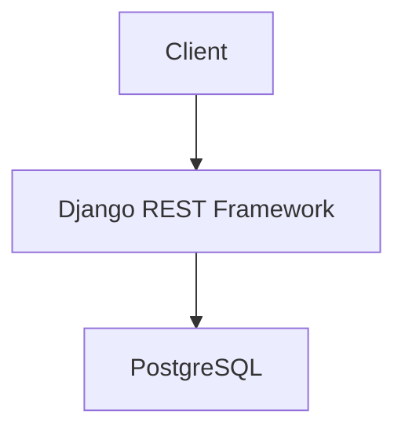
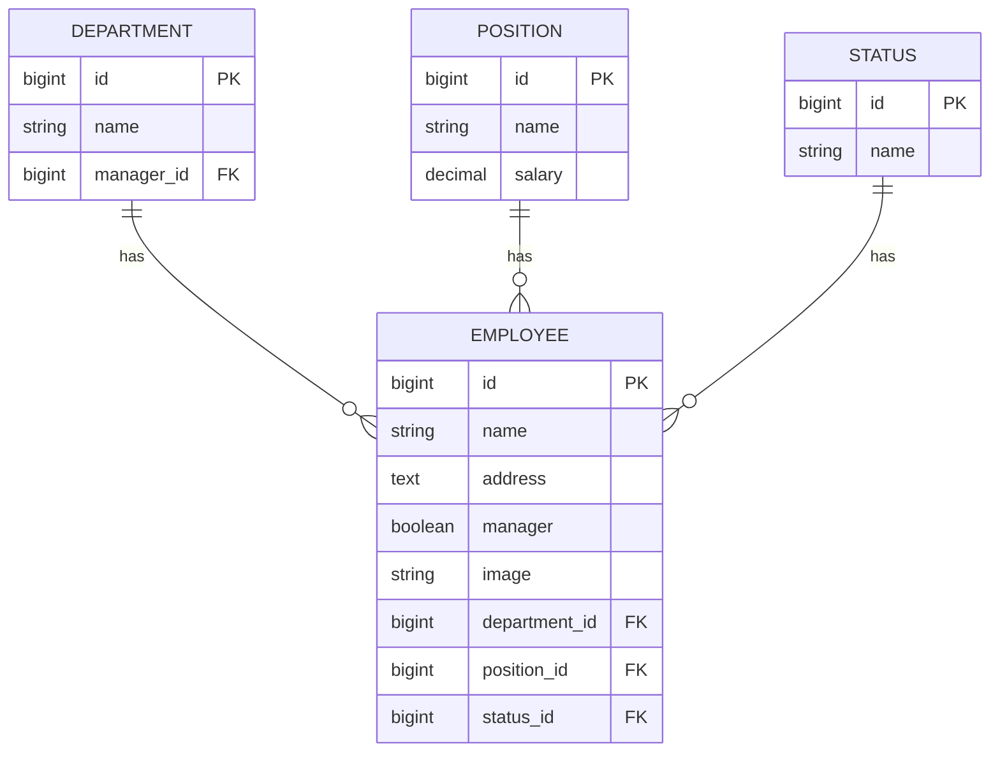

# Employee Management System


A CRUD RESTful API built with Django REST Framework for managing employees, departments, positions, and statuses.

## Architecture



## Database Design



## Features

- User Authentication
- Employee CRUD
- Department CRUD
- Position CRUD
- Status CRUD
- Search Employees
- Filter Employees
- Pagination
- PostgreSQL Database
- Django Admin
- Unit Tests

---

## Tech Stack

- Python
- Django
- Django REST Framework
- PostgreSQL
- django-filter
- Pillow

---

## Installation

Clone the repository

```bash
git clone https://github.com/Sukphadech/changan-crud-api.git
```

Create Virtual Environment

```bash
python -m venv venv
```

Activate Virtual Environment

Windows

```bash
venv\Scripts\activate
```

Install dependencies

```bash
pip install -r requirements.txt
```

---

## Database

Create PostgreSQL database

```
employee_db
```

Update

```
config/settings/development.py
```

Configure

```
DATABASES
```

---

## Run Migration

```bash
python manage.py makemigrations

python manage.py migrate
```

---

## Create Superuser

```bash
python manage.py createsuperuser
```

---

## Run Server

```bash
python manage.py runserver
```

Open

```
http://127.0.0.1:8000/
```

---

## API Endpoints

Employee

```
/api/employees/
```

Department

```
/api/departments/
```

Position

```
/api/positions/
```

Status

```
/api/statuses/
```

---

## Search

```
/api/employees/?search=john
```

---

## Filter

```
/api/employees/?department=1

/api/employees/?position=1

/api/employees/?status=1
```

---

## Pagination

```
/api/employees/?page=2
```

---

## Run Tests

Run all tests

```bash
python manage.py test
```

Run model tests

```bash
python manage.py test employees.tests.test_models
```

Run API tests

```bash
python manage.py test employees.tests.test_api
```

Run filter tests

```bash
python manage.py test employees.tests.test_filters
```

Run search tests

```bash
python manage.py test employees.tests.test_search
```

Run authentication tests

```bash
python manage.py test employees.tests.test_authentication
```

---

## Project Structure

```
employees/
│
├── models.py
├── serializers.py
├── views.py
├── urls.py
│
└── tests/
    ├── test_models.py
    ├── test_api.py
    ├── test_filters.py
    ├── test_search.py
    └── test_authentication.py
```

---

## Author

Sukphadech Thiangthit
